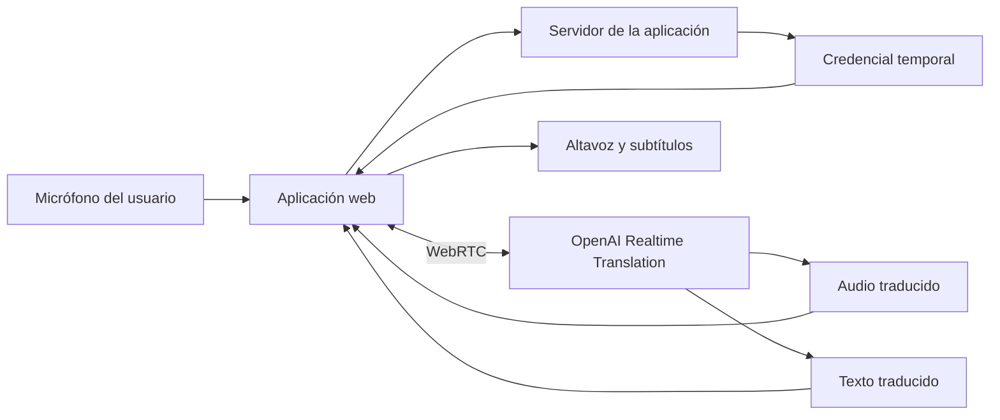

# Realtime Voice Translator

Aplicación web para facilitar conversaciones entre personas que hablan idiomas diferentes mediante traducción de voz bidireccional en tiempo real.

El proyecto busca ofrecer una experiencia sencilla: cada persona habla en su idioma, escucha la traducción mediante voz y puede consultar tanto el texto original como el traducido.

> Estado actual: planificación, diseño y especificación del MVP.

---

## Visión

Las herramientas tradicionales de traducción suelen interrumpir la conversación porque obligan a escribir, copiar texto o esperar una traducción completa.

Realtime Voice Translator busca reducir esa fricción mediante una experiencia de conversación en la que:

* Cada participante utiliza su propio idioma.
* La aplicación captura la voz mientras la persona habla.
* La traducción se reproduce mediante audio.
* El texto original y traducido permanece visible.
* Los participantes controlan claramente cuándo pueden hablar.

El objetivo inicial no es reemplazar a un intérprete profesional, sino facilitar conversaciones cotidianas de manera rápida, clara y accesible.

---

## Objetivo del MVP

Construir una aplicación web que permita a dos personas mantener una conversación presencial utilizando un único celular o computador.

La primera versión estará enfocada en conversaciones entre español e inglés mediante una interacción de tipo **mantener presionado para hablar**.

### Flujo principal

1. El usuario abre la aplicación.
2. Selecciona el idioma de la persona A.
3. Selecciona el idioma de la persona B.
4. Autoriza el uso del micrófono.
5. La persona A mantiene presionado su botón y habla.
6. La aplicación procesa la intervención.
7. Se muestra el texto original.
8. Se muestra el texto traducido.
9. La traducción se reproduce mediante audio.
10. La persona B responde utilizando su propio botón.
11. La conversación continúa alternando participantes.

---

## Funcionalidades del MVP

* Selección de dos idiomas diferentes.
* Botón independiente para cada participante.
* Captura de audio desde el navegador.
* Traducción de voz en tiempo real.
* Reproducción automática del audio traducido.
* Visualización del texto original.
* Visualización del texto traducido.
* Historial temporal de intervenciones.
* Indicadores de estado:

  * Listo.
  * Escuchando.
  * Traduciendo.
  * Reproduciendo.
  * Sin conexión.
  * Error.
* Bloqueo de intervenciones simultáneas.
* Opción para detener el audio.
* Opción para finalizar la conversación.
* Opción para borrar los datos locales de la sesión.

---

## Fuera del alcance inicial

La primera versión no incluirá:

* Conversaciones grupales.
* Llamadas telefónicas.
* Videollamadas.
* Traducción completamente simultánea.
* Funcionamiento sin conexión.
* Clonación de voz.
* Registro de usuarios.
* Planes de pago.
* Historial permanente.
* Aplicaciones móviles nativas.
* Traducciones médicas, jurídicas o certificadas.
* Personalización avanzada de voces.
* Integración con WhatsApp, Telegram o servicios de telefonía.

Estas capacidades podrán evaluarse después de validar el funcionamiento y la utilidad del MVP.

---

## Arquitectura inicial



### Flujo técnico

1. El navegador solicita permiso para utilizar el micrófono.
2. La aplicación solicita al backend una credencial temporal.
3. El backend genera la credencial utilizando la API key privada.
4. El navegador establece una conexión WebRTC.
5. El audio se envía al servicio de traducción.
6. La aplicación recibe audio y texto traducidos.
7. El navegador reproduce el resultado y actualiza la interfaz.

La API key privada nunca debe enviarse al navegador.

---

## Stack tecnológico previsto

### Frontend

* Next.js
* React
* TypeScript
* Tailwind CSS
* Web Audio API
* MediaDevices API
* WebRTC

### Backend

* Route Handlers de Next.js
* Node.js
* API de OpenAI
* Generación de credenciales temporales
* Validación de solicitudes
* Control básico de uso

### Calidad

* ESLint
* Prettier
* TypeScript en modo estricto
* Vitest
* React Testing Library
* Playwright

### Desarrollo

* Git
* GitHub
* Codex
* Spec-Driven Development
* Docker en etapas posteriores

---

## Modelo de traducción previsto

La primera prueba técnica utilizará:

```text
gpt-realtime-translate
```

El modelo se integrará mediante una sesión de traducción en tiempo real.

La arquitectura deberá mantener una separación entre la aplicación y el proveedor de traducción para facilitar cambios futuros.

```ts
interface TranslationProvider {
  connect(config: TranslationSessionConfig): Promise<void>;
  startAudio(): Promise<void>;
  stopAudio(): Promise<void>;
  disconnect(): Promise<void>;
}
```

La aplicación no deberá depender directamente del proveedor desde los componentes visuales.

---

## Desarrollo guiado por especificaciones

Este proyecto utiliza **Spec-Driven Development — SDD**.

Cada funcionalidad debe definirse antes de ser implementada.

### Flujo de trabajo

```text
Necesidad
   ↓
Especificación funcional
   ↓
Diseño técnico
   ↓
Criterios de aceptación
   ↓
Lista de tareas
   ↓
Implementación
   ↓
Pruebas
   ↓
Revisión
```

Cada característica tendrá su propio directorio:

```text
docs/specs/001-nombre-funcionalidad/
├── spec.md
├── design.md
├── tasks.md
└── acceptance.md
```

### Contenido de cada archivo

#### `spec.md`

Define:

* Problema que se quiere resolver.
* Historias de usuario.
* Requisitos funcionales.
* Requisitos no funcionales.
* Casos límite.
* Funcionalidades fuera del alcance.

#### `design.md`

Define:

* Arquitectura.
* Componentes.
* Interfaces.
* Flujo de datos.
* Decisiones técnicas.
* Manejo de errores.
* Consideraciones de seguridad.

#### `tasks.md`

Contiene las tareas pequeñas y verificables que Codex deberá implementar.

#### `acceptance.md`

Contiene los criterios que deben cumplirse antes de considerar terminada la funcionalidad.

---

## Uso de Codex

Codex debe trabajar únicamente sobre especificaciones aprobadas.

Antes de comenzar una tarea deberá:

1. Leer `AGENTS.md`.
2. Leer la especificación correspondiente.
3. Revisar la arquitectura existente.
4. Identificar archivos que deben modificarse.
5. Implementar únicamente el alcance solicitado.
6. Ejecutar las pruebas relacionadas.
7. Informar decisiones o ambigüedades encontradas.
8. No agregar dependencias sin justificación.
9. No modificar funcionalidades ajenas a la tarea.
10. No marcar una tarea como finalizada si las pruebas fallan.

---

## Estructura prevista del repositorio

```text
realtime-voice-translator/
├── AGENTS.md
├── README.md
├── .env.example
├── .gitignore
├── package.json
├── docs/
│   ├── product/
│   │   ├── vision.md
│   │   ├── scope.md
│   │   └── user-flows.md
│   ├── architecture/
│   │   ├── system-design.md
│   │   └── adr/
│   ├── specs/
│   │   ├── 001-audio-translation-spike/
│   │   │   ├── spec.md
│   │   │   ├── design.md
│   │   │   ├── tasks.md
│   │   │   └── acceptance.md
│   │   └── 002-face-to-face-mvp/
│   └── evals/
│       ├── translation-cases.json
│       └── latency-cases.json
├── src/
│   ├── app/
│   ├── components/
│   ├── features/
│   │   └── translation/
│   ├── hooks/
│   ├── lib/
│   ├── providers/
│   └── types/
├── tests/
│   ├── unit/
│   ├── integration/
│   └── e2e/
└── public/
```

La estructura podrá cambiar durante el diseño técnico, pero cualquier cambio relevante deberá documentarse.

---

## Configuración local prevista

### Requisitos

* Node.js en una versión LTS compatible.
* Gestor de paquetes npm.
* Cuenta de OpenAI con acceso a la API.
* Navegador con soporte para micrófono y WebRTC.

### Instalación

```bash
git clone https://github.com/USUARIO/realtime-voice-translator.git
cd realtime-voice-translator
npm install
```

Crear el archivo de variables de entorno:

```bash
cp .env.example .env.local
```

Agregar la API key exclusivamente en el servidor:

```env
OPENAI_API_KEY=
OPENAI_REALTIME_TRANSLATION_MODEL=gpt-realtime-translate
```

Iniciar el entorno de desarrollo:

```bash
npm run dev
```

Abrir en el navegador:

```text
http://localhost:3000
```

> Los comandos estarán disponibles después de crear la estructura inicial de Next.js.

---

## Scripts previstos

```bash
npm run dev
npm run build
npm run start
npm run lint
npm run typecheck
npm run test
npm run test:e2e
```

Todos los cambios deben superar como mínimo:

```bash
npm run lint
npm run typecheck
npm run test
```

---

## Seguridad y privacidad

El proyecto seguirá estos principios:

* La API key privada nunca estará disponible en el cliente.
* El navegador utilizará credenciales temporales.
* El audio no se almacenará por defecto.
* Las conversaciones no se guardarán sin autorización explícita.
* Los errores no mostrarán secretos ni datos privados.
* Los archivos `.env` no se subirán al repositorio.
* Los permisos del micrófono se solicitarán de forma clara.
* El usuario podrá finalizar y borrar la sesión.
* Las entradas provenientes del cliente serán validadas.
* Se establecerán límites de duración y consumo por sesión.

---

## Principios de diseño

La interfaz debe ser:

* Sencilla.
* Comprensible sin instrucciones extensas.
* Adaptable a celulares y computadores.
* Accesible mediante teclado.
* Clara sobre cuál persona puede hablar.
* Clara sobre el estado actual de la traducción.
* Resistente a desconexiones y errores.
* Utilizable por personas con pocos conocimientos tecnológicos.

La aplicación debe priorizar la conversación sobre la cantidad de opciones disponibles.

---

## Objetivos de calidad

### Latencia

La traducción debe comenzar lo antes posible después de que el usuario empiece o termine una intervención.

Se medirán por separado:

* Tiempo hasta el primer audio traducido.
* Tiempo hasta el primer texto traducido.
* Tiempo total de la intervención.
* Tiempo de recuperación después de una desconexión.

### Traducción

Las evaluaciones incluirán:

* Conversaciones cotidianas.
* Nombres propios.
* Números.
* Fechas.
* Direcciones.
* Monedas.
* Diferentes acentos.
* Velocidades de habla.
* Ruido ambiental.
* Frases incompletas.
* Cambios de idioma durante una intervención.

### Estabilidad

La aplicación debe manejar:

* Micrófono denegado.
* Micrófono desconectado.
* Pérdida de internet.
* Sesión vencida.
* Error del proveedor.
* Audio vacío.
* Intervenciones simultáneas.
* Cierre inesperado de la conexión.

---

## Criterio de aceptación del MVP

El MVP será considerado funcional cuando:

* Dos personas puedan seleccionar idiomas diferentes.
* Cada persona pueda controlar cuándo habla.
* El audio sea capturado correctamente.
* La traducción sea reproducida en el idioma contrario.
* Se muestre el texto original.
* Se muestre el texto traducido.
* Las intervenciones se diferencien visualmente.
* Ambas personas puedan intercambiar al menos diez intervenciones.
* No sea necesario reiniciar la aplicación durante la conversación.
* La API key no aparezca en el navegador.
* El usuario pueda finalizar y borrar la conversación.
* Los errores principales tengan mensajes comprensibles.

---

## Roadmap

### Fase 0 — Preparación

* [ ] Crear el repositorio.
* [ ] Crear el proyecto Next.js.
* [ ] Configurar TypeScript.
* [ ] Configurar ESLint y formato.
* [ ] Crear `AGENTS.md`.
* [ ] Crear estructura de documentación.
* [ ] Definir reglas de ramas y commits.

### Fase 1 — Prueba técnica de audio

* [ ] Solicitar acceso al micrófono.
* [ ] Capturar audio.
* [ ] Crear credenciales temporales.
* [ ] Establecer una conexión WebRTC.
* [ ] Enviar audio.
* [ ] Recibir audio traducido.
* [ ] Mostrar eventos y errores.
* [ ] Medir latencia básica.

### Fase 2 — MVP presencial

* [ ] Crear selector de idiomas.
* [ ] Crear controles para dos participantes.
* [ ] Implementar mantener presionado para hablar.
* [ ] Mostrar texto original y traducido.
* [ ] Reproducir traducciones.
* [ ] Crear historial temporal.
* [ ] Implementar finalización de sesión.

### Fase 3 — Evaluación

* [ ] Crear conjunto de frases de prueba.
* [ ] Medir calidad de traducción.
* [ ] Medir latencia.
* [ ] Probar diferentes dispositivos.
* [ ] Probar conexiones lentas.
* [ ] Documentar errores frecuentes.
* [ ] Realizar pruebas con usuarios.

### Fase 4 — Evolución

* [ ] Convertir la aplicación en PWA.
* [ ] Evaluar conversaciones remotas.
* [ ] Evaluar integración con videollamadas.
* [ ] Agregar glosarios especializados.
* [ ] Agregar autenticación.
* [ ] Implementar límites de consumo.
* [ ] Evaluar planes de pago.

---

## Estado del proyecto

El proyecto se encuentra actualmente en la etapa de diseño y especificación.

Todavía no debe considerarse preparado para producción ni para conversaciones críticas.

---

## Licencia

La licencia del proyecto se definirá antes de publicar una primera versión estable.
