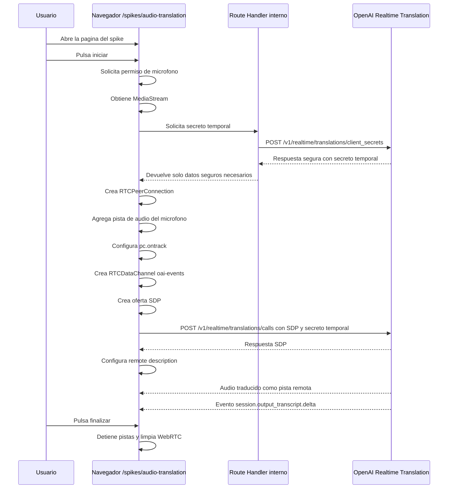

# 001 Audio Translation Spike - Diseño

## Arquitectura

El spike usa una página dedicada de Next.js para ejecutar una prueba unilateral en navegador. El servidor solo participa para crear un secreto temporal con la API key privada. La negociación WebRTC con OpenAI se realiza desde el navegador usando ese secreto temporal.

Componentes previstos:

- Página del spike en `/spikes/audio-translation`.
- Route Handler interno en `/api/realtime/translations/session`.
- Cliente de navegador responsable de micrófono, WebRTC, audio remoto, eventos y limpieza.
- OpenAI Realtime Translation como proveedor externo.

No se usará SDK de OpenAI. El Route Handler usará `fetch` nativo.

## Diagrama Mermaid del flujo



## Responsabilidades del navegador

- Renderizar la página `/spikes/audio-translation`.
- Mostrar objetivo, estado principal, indicadores secundarios, subtítulos y controles mínimos.
- Solicitar permiso de micrófono cuando el usuario inicia la prueba.
- Obtener y conservar temporalmente el `MediaStream` local.
- Solicitar el secreto temporal al Route Handler interno.
- Crear `RTCPeerConnection`.
- Añadir la pista de audio del micrófono a la conexión.
- Configurar `pc.ontrack` para recibir audio remoto traducido.
- Crear `RTCDataChannel` con nombre `oai-events`.
- Crear la oferta SDP.
- Enviar la oferta SDP a `POST https://api.openai.com/v1/realtime/translations/calls` usando el secreto temporal.
- Configurar la respuesta SDP como remote description.
- Reproducir el audio remoto recibido.
- Procesar eventos recibidos en `oai-events`.
- Detectar `session.output_transcript.delta` y actualizar los subtítulos incrementales.
- Mostrar errores normalizados y comprensibles.
- Finalizar la prueba y liberar recursos.
- Evitar persistir audio y transcripciones.
- Evitar acceder a `OPENAI_API_KEY`.

## Responsabilidades del Route Handler

- Exponer `POST /api/realtime/translations/session`.
- Ejecutarse únicamente en servidor.
- Leer `OPENAI_API_KEY` desde variables de entorno del servidor.
- Rechazar la solicitud si `OPENAI_API_KEY` no está configurada.
- Crear el secreto temporal mediante `fetch` nativo.
- Llamar a `POST https://api.openai.com/v1/realtime/translations/client_secrets`.
- Enviar la configuración mínima de sesión aprobada.
- Devolver al navegador solo la respuesta segura necesaria, incluyendo el secreto temporal.
- No devolver `OPENAI_API_KEY`.
- No almacenar audio.
- No almacenar transcripciones.
- No usar base de datos.
- No usar autenticación.
- Normalizar errores antes de responder al navegador.
- No registrar secretos ni contenido hablado.

## Endpoint interno previsto

```text
POST /api/realtime/translations/session
```

Uso previsto:

- Lo invoca el navegador antes de crear la negociación WebRTC.
- Devuelve datos seguros suficientes para que el navegador negocie con OpenAI.
- No acepta audio ni transcripciones.
- No persiste información.

## Endpoint de creación del client secret

```text
POST https://api.openai.com/v1/realtime/translations/client_secrets
```

Uso previsto:

- Lo invoca solo el servidor.
- Usa `OPENAI_API_KEY` en la autorización de servidor.
- Crea un secreto temporal para la sesión de traducción.
- La forma exacta de cabeceras y payload debe validarse contra la documentación oficial antes de implementar.

## Endpoint de negociación SDP

```text
POST https://api.openai.com/v1/realtime/translations/calls
```

Uso previsto:

- Lo invoca el navegador.
- Envía la oferta SDP creada por `RTCPeerConnection`.
- Usa el secreto temporal recibido desde el Route Handler.
- Devuelve una respuesta SDP que el navegador configura como remote description.
- La forma exacta de cabeceras, `Content-Type`, body y respuesta debe validarse contra la documentación oficial antes de implementar.

## Configuración mínima de la sesión

La configuración mínima aprobada para crear el secreto temporal es:

```json
{
  "model": "gpt-realtime-translate",
  "audio": {
    "output": {
      "language": "en"
    }
  }
}
```

No se documenta ningún parámetro de idioma de entrada. Las pruebas se harán hablando español. El único idioma configurado mediante API en este spike es el idioma objetivo `"en"`.

## Ciclo de vida de RTCPeerConnection

1. El usuario pulsa iniciar.
2. La aplicación obtiene el `MediaStream` local.
3. La aplicación solicita el secreto temporal al servidor.
4. La aplicación crea una instancia de `RTCPeerConnection`.
5. La aplicación añade la pista de audio del micrófono al peer connection.
6. La aplicación configura `pc.ontrack` antes de completar la negociación.
7. La aplicación crea el `RTCDataChannel` llamado `oai-events`.
8. La aplicación crea una oferta SDP con `createOffer`.
9. La aplicación configura la oferta como local description.
10. La aplicación envía el SDP a OpenAI usando el secreto temporal.
11. La aplicación recibe la respuesta SDP.
12. La aplicación configura la respuesta como remote description.
13. La aplicación pasa a estado principal `active` cuando la conexión queda lista para la prueba.
14. La aplicación observa cambios de conexión para detectar pérdida o fallo.
15. La aplicación cierra el canal de datos, cierra `RTCPeerConnection` y limpia referencias al finalizar.

No se documenta `session.close` como requisito de WebRTC para este spike.

## Uso de la pista remota para audio

El audio traducido se recibirá como pista remota mediante `pc.ontrack`.

La implementación futura debe:

- Crear o reutilizar un elemento de audio en la página del spike.
- Asociar la pista o stream remoto al elemento de audio.
- Intentar reproducir el audio dentro del flujo iniciado por interacción del usuario.
- Mostrar un error comprensible si el navegador bloquea la reproducción.
- Desasociar el stream remoto al finalizar.

## Uso de oai-events para eventos

El navegador creará un `RTCDataChannel` llamado `oai-events`.

Uso previsto:

- Recibir eventos de sesión enviados por OpenAI.
- Parsear eventos de forma defensiva.
- Ignorar eventos no relevantes para este spike.
- Detectar eventos de subtítulos incrementales.
- Mostrar errores si el canal falla o recibe datos inválidos.

La forma exacta de serialización de los mensajes debe validarse contra la documentación oficial antes de implementar.

## Manejo de session.output_transcript.delta

El evento relevante para subtítulos incrementales es:

```text
session.output_transcript.delta
```

La implementación futura debe:

- Detectar este evento en los mensajes recibidos por `oai-events`.
- Extraer el fragmento incremental de texto traducido según el contrato oficial.
- Acumular o mostrar el texto incremental en la UI.
- Tratar el texto como temporal y no persistirlo.
- No asumir nombres de campos internos hasta validarlos contra la documentación oficial.

## Estados e indicadores

Estados principales:

- `idle`.
- `requesting-permission`.
- `creating-session`.
- `connecting`.
- `active`.
- `stopping`.
- `stopped`.
- `error`.

Indicadores secundarios durante `active`:

- Micrófono activo.
- Recibiendo subtítulos.
- Reproduciendo audio.

`listening`, `translating` y `playing` no son estados principales mutuamente excluyentes en este spike. La UI debe representarlos, si hace falta, como indicadores secundarios compatibles con `active`.

## Estrategia de errores

- Validar capacidades del navegador antes de iniciar o al inicio de la prueba.
- Mostrar error específico si el permiso de micrófono se deniega.
- Mostrar error específico si no hay micrófono disponible.
- Mostrar error normalizado si falla el Route Handler.
- Mostrar error normalizado si falta configuración del servidor.
- Mostrar error normalizado si OpenAI rechaza el secreto temporal.
- Mostrar error si falla la negociación SDP.
- Mostrar error si WebRTC se desconecta o falla.
- Mostrar error si el canal `oai-events` falla.
- Mostrar error si no puede reproducirse el audio remoto.
- Ejecutar limpieza de recursos después de errores terminales.
- Evitar mostrar tokens, secretos, cabeceras o respuestas completas del proveedor.

## Limpieza de recursos

La limpieza debe ejecutarse al finalizar manualmente, ante error terminal y al desmontar la página.

Recursos a limpiar:

- Pistas del `MediaStream` local mediante `track.stop()`.
- Referencias al `MediaStream` local.
- Stream o pista remota usada por audio.
- Referencia `srcObject` del elemento de audio.
- Canal de datos `oai-events`.
- `RTCPeerConnection`.
- Handlers registrados en objetos WebRTC.
- Estado transitorio de subtítulos.
- Indicadores secundarios activos.

La limpieza debe tolerar recursos parcialmente inicializados o ya cerrados.

## Seguridad

- `OPENAI_API_KEY` solo se usa en el Route Handler.
- El navegador nunca recibe `OPENAI_API_KEY`.
- El navegador usa únicamente el secreto temporal devuelto por el servidor.
- El Route Handler debe validar que la respuesta enviada al cliente no incluya la API key privada.
- No se usará el SDK de OpenAI en este spike.
- No se usará autenticación.
- No se usará base de datos.
- No se registrarán secretos en consola ni logs.
- No se usará `response.create`.

## Privacidad

- El audio capturado solo vive durante la sesión activa del navegador.
- Las transcripciones y subtítulos no se persisten.
- El servidor no recibe audio del usuario en este diseño.
- El servidor no almacena datos de sesión.
- La página debe permitir finalizar y liberar el micrófono.
- Los logs no deben incluir contenido hablado ni subtítulos.

## Estrategia de validación manual y automatizada

Validación automatizable:

- La página `/spikes/audio-translation` renderiza contenido básico.
- El Route Handler rechaza solicitudes cuando falta `OPENAI_API_KEY`.
- El Route Handler no devuelve `OPENAI_API_KEY`.
- La configuración enviada al endpoint de secretos incluye `model: gpt-realtime-translate` y `audio.output.language: "en"`.
- El código no contiene uso de `response.create`.
- La lógica de limpieza llama a cierre de tracks, canal de datos y peer connection cuando existen.
- Los estados principales se representan con valores definidos.

Validación manual requerida:

- Permiso real de micrófono en Chrome de escritorio.
- Permiso real de micrófono en Edge de escritorio.
- Negociación WebRTC real con OpenAI.
- Envío de audio hablado en español.
- Recepción y reproducción de audio traducido en inglés.
- Recepción de `session.output_transcript.delta`.
- Confirmación visual de que el micrófono queda apagado al finalizar.
- Comportamiento ante pérdida real de conexión.

## Referencias a documentación oficial

Antes de implementar, deben validarse los detalles exactos contra documentación oficial de:

- OpenAI Realtime Translation para `POST /v1/realtime/translations/client_secrets`.
- OpenAI Realtime Translation para `POST /v1/realtime/translations/calls`.
- OpenAI Realtime Translation para eventos de sesión y `session.output_transcript.delta`.
- MDN Web Docs para `navigator.mediaDevices.getUserMedia`.
- MDN Web Docs para `RTCPeerConnection`.
- MDN Web Docs para `RTCDataChannel`.
- MDN Web Docs para reproducción de audio con `HTMLMediaElement` y `srcObject`.

Los nombres de campos internos de payloads, cabeceras exactas y estructura de eventos no deben asumirse hasta esa validación.

## Decisiones todavía abiertas

- Forma exacta del payload seguro que el Route Handler devolverá al navegador después de recibir el secreto temporal.
- Forma exacta de extracción del fragmento de texto dentro de `session.output_transcript.delta`.
- Mensajes finales de error para usuarios no técnicos.
- Si se agregará una medición básica de latencia durante este spike o se dejará para una especificación posterior.
